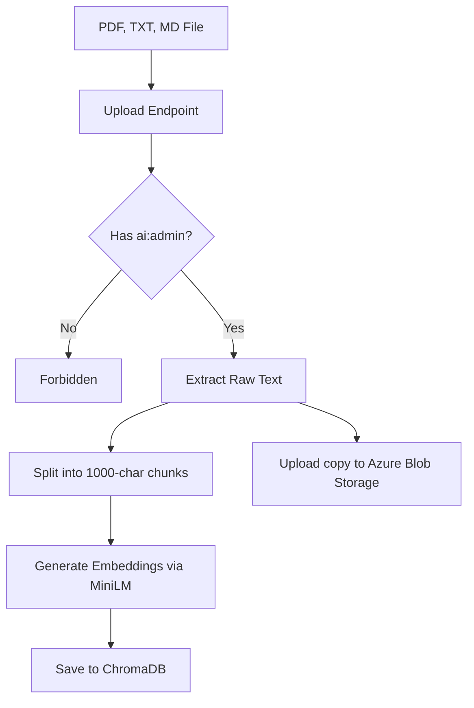
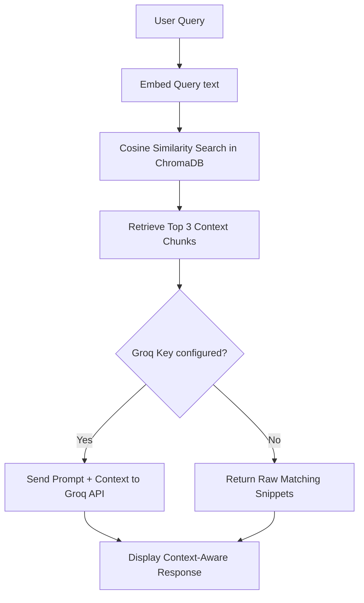

# 🧠 OrganiStation AI/RAG Service

The **AI/RAG Service** is a Python FastAPI microservice that implements a robust **Retrieval-Augmented Generation (RAG)** pipeline. It allows OrganiStation to store, search, and retrieve company knowledge (such as policy docs, handbook guidelines, or manuals) and generate highly context-aware, accurate answers to user queries.

---

## ✨ Key Features

- **Document Ingestion**: Parses, chunks, and vectorizes `.pdf`, `.txt`, and `.md` files.
- **Local Embedding Generation**: Automatically generates vector embeddings locally using the sentence-transformers model (`all-MiniLM-L6-v2`) via ChromaDB—no external API keys required for embedding.
- **Fast Vector Database**: Uses **ChromaDB** as a persistent, high-performance local vector database.
- **Groq LLM Integration**: Generates refined, context-based answers using the **Groq API** (powered by models like `llama-3.3-70b-versatile`). Falls back gracefully to raw document snippet retrieval if no Groq API key is provided.
- **Cloud Backup**: Automatically synchronizes and backs up original PDF uploads to **Azure Blob Storage** if configured.
- **Granular Authorization**: Protects administration endpoints (ingestion, deletion, and database resets) by verifying `ai:admin` permissions via HTTP headers.

---

## 🛠️ Technology Stack

- **Framework**: FastAPI (Python 3.10+)
- **Vector Database**: ChromaDB
- **PDF Extraction**: `pypdf`
- **LLM Client**: `requests` (Groq Chat Completions API)
- **Cloud Storage Client**: `azure-storage-blob`

---

## 📂 Architecture & Workflows

### 📥 1. Ingestion Workflow


### 🔍 2. Query Workflow


---

## ⚙️ Configuration & Environment Variables

Create a `.env` file in the root of the `ai-service` directory (you can copy `.env.example` as a starting point).

| Variable | Description | Default | Required |
| :--- | :--- | :--- | :--- |
| `PORT` | Service port | `8000` | No |
| `HOST` | Bind address | `0.0.0.0` | No |
| `CHROMA_DB_PATH` | Directory where ChromaDB indexes are persisted | `./chroma_db` | No |
| `GROQ_API_KEY` | Your Groq Cloud API Key | *None* | Optional (for LLM generation) |
| `GROQ_MODEL` | Groq LLM model name | `llama-3.3-70b-versatile` | No |
| `AZURE_STORAGE_CONNECTION_STRING` | Azure Blob Storage connection string | *None* | Optional (for cloud backup) |

---

## 🚀 API Endpoints

### 🟢 Public Endpoints

* **`GET /health`** (or `/api/health`, `/`)
  - Health check endpoint showing system status, database config, and model provider details.
  
* **`POST /api/query`** (or `/query`)
  - Queries the database and returns an answer along with sources.
  - **Payload**:
    ```json
    {
      "query": "What is the company policy on remote work?"
    }
    ```

* **`GET /api/documents`** (or `/documents`)
  - Lists all successfully ingested document filenames.

* **`GET /api/documents/view/{doc_hash}`** (or `/documents/view/{doc_hash}`)
  - Serves the original document file (PDF, TXT, or MD) for viewing.

---

### 🔴 Admin Endpoints (Requires `X-User-Permissions: ["ai:admin"]` header)

* **`POST /api/ingest`** (or `/ingest`)
  - Uploads and processes a document.
  - **Body**: `multipart/form-data` with `file`.

* **`DELETE /api/documents/{doc_hash}`** (or `/documents/{doc_hash}`)
  - Deletes all vectorized chunks of a document and its stored physical file.

* **`POST /api/reset`** (or `/reset`)
  - Deletes all collections and physical documents, restoring the system to a clean state.

---

## 💻 Local Development

### 1. Setup Virtual Environment
```bash
python -m venv venv
source venv/bin/activate  # On Windows: .\venv\Scripts\activate
pip install -r requirements.txt
```

### 2. Run the Server
```bash
python src/app.py
```
The server will start at `http://localhost:8000`. You can access the interactive API docs at `http://localhost:8000/docs`.

---

## 🐳 Docker Deployment

To build and run the service in a container:

```bash
# Build the Image
docker build -t organistation-ai-service .

# Run the Container
docker run -d \
  -p 8000:8000 \
  --env-file .env \
  -v chroma_data:/app/chroma_db \
  organistation-ai-service
```
